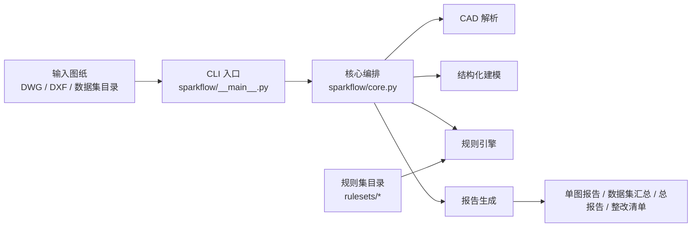
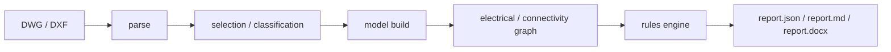
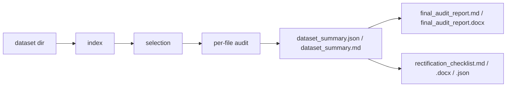
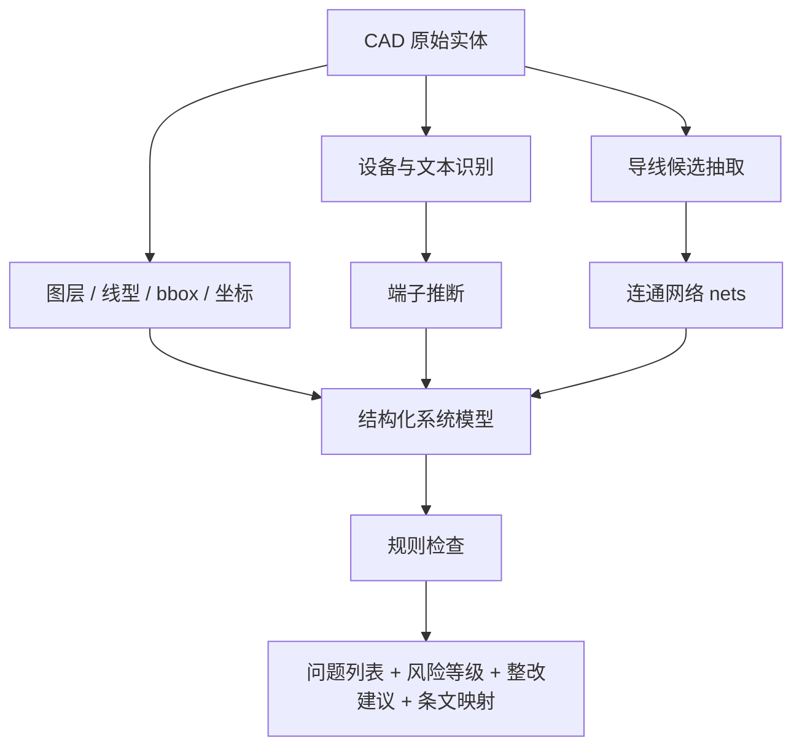
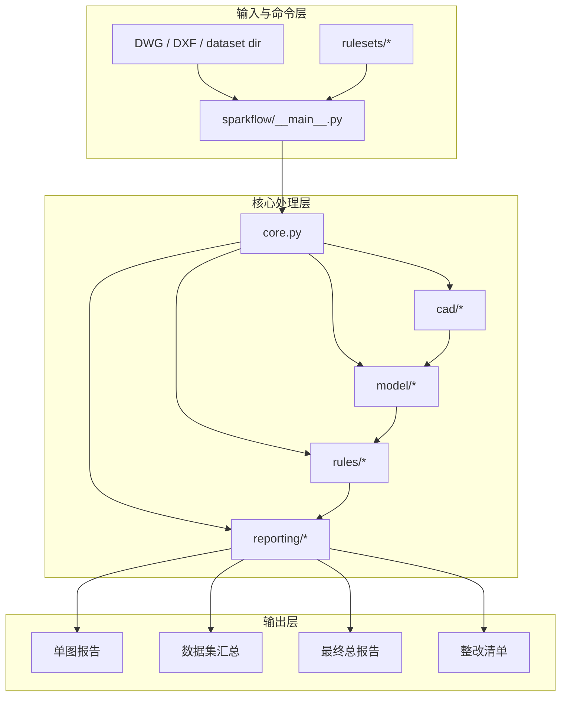
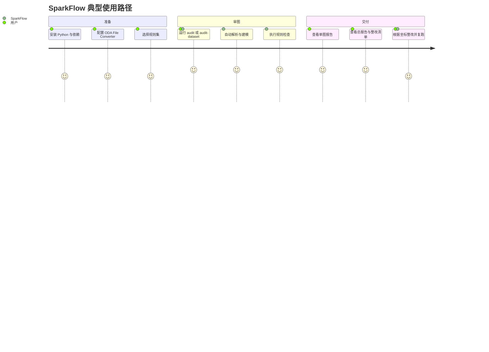

# 项目概览与架构

## 1. 项目目标

SparkFlow 的目标是把配电/一次系统图的自动审图流程做成一条可复跑、可追溯的本地链路：

`CAD 图纸 -> 解析 -> 结构化建模 -> 规则检查 -> 单图报告 -> 数据集汇总 -> 总报告/整改清单`

当前重点是：

- 一次系统图、单线图、电气图
- 低压开关柜、综合配电箱、电缆分支箱
- 数据集批量审图与规则回归

## 2. 主流程

### 2.0 系统总览图

### 2.1 单图流程

### 2.2 数据集流程

### 2.3 数据处理示意图

## 3. 主要模块

### 3.0 功能架构图

### 3.1 入口

- [`sparkflow/__main__.py`](../sparkflow/__main__.py)

负责：

- CLI 参数解析
- `audit`
- `audit-dataset`
- `dataset-report`
- `rectification-checklist`
- `ruleset-diff`

### 3.2 核心审图流程

- [`sparkflow/core.py`](../sparkflow/core.py)

负责：

- 单文件审图
- 数据集批量审图
- 汇总文件落盘

### 3.3 CAD 解析

- [`sparkflow/cad/`](../sparkflow/cad)

负责：

- `DXF` 解析
- `DWG -> DXF` 转换调用
- ODA / AutoCAD COM 后端适配

### 3.4 建模

- [`sparkflow/model/`](../sparkflow/model)

负责：

- 导线候选抽取
- 设备识别
- 端子推断
- 连通图与电气图建模

### 3.5 规则系统

- [`sparkflow/rules/`](../sparkflow/rules)

负责：

- 规则加载
- 规则注册
- 规则执行
- 规则集差异比对

### 3.6 报告系统

- [`sparkflow/reporting/`](../sparkflow/reporting)

负责：

- 单图 Markdown / DOCX 报告
- 数据集总报告
- 整改清单
- 正式交付字段，如条文映射、整改建议、风险等级、置信度

## 4. 支持的规则输入

当前规则输入支持四类：

- 结构化 `ruleset.json`
- `CSV/TSV`
- `XLSX`
- 结构化 `Markdown` 规范摘要

规则集都位于 [`rulesets/`](../rulesets)。

## 5. 当前产物类型

### 单图

- `report.json`
- `report.md`
- `report.docx`
- `connectivity.json`
- `electrical.json`

### 数据集

- `dataset_index.json`
- `dataset_selection.json`
- `dataset_summary.json`
- `dataset_summary.md`
- `final_audit_report.md`
- `final_audit_report.docx`
- `rectification_checklist.md`
- `rectification_checklist.docx`
- `rectification_checklist.json`

## 6. 当前边界

当前项目仍是 CLI-first 工具链，不是完整平台：

- 没有 Web 服务入口
- 没有任务队列/数据库/用户系统
- 没有人工复核流转界面
- 没有自然语言规则自动抽取成生产级规则

但它已经适合：

- 样本集批量跑批
- 审图报告归档
- 规则回归和版本对比
- 坐标级整改清单生成

## 7. 使用视角示意图

