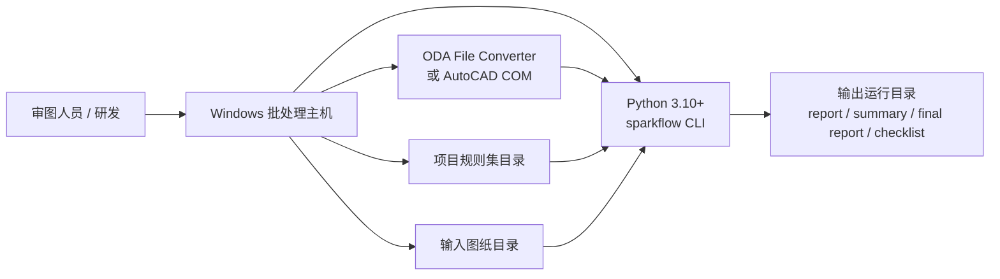

# 部署、环境与运维建议

## 0. 部署示意图



## 1. 推荐部署形态

当前推荐形态是：

- 本地 Windows 工作站
- 研发/审图离线批处理机
- 任务调度式批跑节点

不推荐直接宣传为在线多用户平台。

## 2. 基础环境

### 必需

- Windows 10/11
- Python `3.10+`
- `ezdxf`
- `python-docx`

### DWG 审图推荐

- `ODA File Converter`

示例路径：

```text
D:\Program Files\ODA\ODAFileConverter 27.1.0\ODAFileConverter.exe
```

### 可选

- AutoCAD
- `pywin32`

用于：

- `--dwg-backend autocad`

## 3. 安装步骤

```powershell
git clone <repo>
cd SparkFlow
python -m pip install -U pip
python -m pip install -e .
```

检查：

```powershell
python -X utf8 -m sparkflow --help
```

## 4. ODA 配置方式

### 方式一：命令行传入

```powershell
--dwg-backend cli --dwg-converter "D:\Program Files\ODA\ODAFileConverter 27.1.0\ODAFileConverter.exe"
```

### 方式二：环境变量

```powershell
$env:SPARKFLOW_DWG2DXF_CMD="D:\Program Files\ODA\ODAFileConverter 27.1.0\ODAFileConverter.exe"
```

## 5. 批处理部署建议

### 5.1 目录规划

建议把输入、输出和归档拆开：

```text
input/
output/
archive/
logs/
```

### 5.2 运行建议

- 固定规则集目录
- 固定输出根目录
- 记录运行命令
- 归档 `dataset_summary.*`
- 对失败批次保留 `rectification_checklist.*`

### 5.3 调度建议

适合：

- Windows Task Scheduler
- Jenkins/本地批任务
- 手工触发批处理脚本

## 6. 生产使用注意事项

- 中文路径较多，建议统一启用 UTF-8
- `DWG` 审图依赖 ODA 或 AutoCAD，可用性要提前验证
- `out/` 下历史运行很多，正式部署建议使用独立输出根目录
- 建议给每次批跑保留运行目录，不要覆盖旧结果

## 7. 版本与回归

当前已支持：

- 规则集差异比较
- 数据集总报告
- 整改清单

建议在部署流程里固定：

- 样本集
- 规则集版本
- ODA 版本
- 审图命令
- 汇总产物

## 8. 当前限制

- 不是服务化部署
- 没有数据库
- 没有 Web 界面
- 没有任务队列
- 没有用户与权限系统

如果后续要做服务化，建议先把现有 CLI 批处理流程稳定封装，再考虑 API/页面层。
