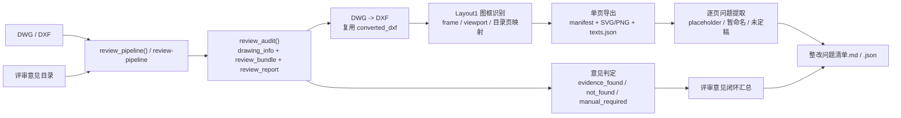

# Review Pipeline

`review-pipeline` 用于把单个 `DWG/DXF` 的复审流程固化成一次接口调用：

- 输入：一份待复审图纸 `DWG/DXF`，以及对应的 `评审意见` 目录。
- 输出：文档驱动复审报告、按图框拆分后的单页图像/文本清单、正式 `整改问题清单`。

## 架构流程图



## 模块分工

| 文件 | 责任 |
| --- | --- |
| `sparkflow/__main__.py` | CLI 参数解析与命令暴露 |
| `sparkflow/review.py` | 图纸结构化提取、评审意见文档加载、复审报告生成 |
| `sparkflow/review_workflow.py` | 编排 `review_audit`、图框拆分、单页文本提取、整改清单汇总 |
| `sparkflow/cad/parse.py` | `DWG/DXF` 解析与 `DWG -> DXF` 转换入口 |
| `sparkflow/cad/dwg_converter.py` | 外部转换器执行 |
| `tests/test_review.py` | 文档驱动复审与整改单生成回归测试 |

## CLI

```powershell
python -m sparkflow review-pipeline `
  "D:\path\drawing.dwg" `
  --review-dir "D:\path\评审意见" `
  --out "D:\path\out" `
  --project-code 030451DY26030001 `
  --dwg-backend cli `
  --dwg-converter "D:\Program Files\ODA\ODAFileConverter 27.1.0\ODAFileConverter.exe" `
  --dxf-backend ascii `
  --skip-sparkflow-audit
```

标准输出依次返回：

1. `run_dir`
2. `整改问题清单.md`
3. `整改问题清单.json`
4. `split/manifest.json`
5. `review_report.json`

## Python API

```python
from pathlib import Path

from sparkflow.cad.parse import CadParseOptions
from sparkflow.review_workflow import review_pipeline

output = review_pipeline(
    Path(r"D:\path\drawing.dwg"),
    Path(r"D:\path\评审意见"),
    Path(r"D:\path\out"),
    project_code="030451DY26030001",
    parse_options=CadParseOptions(
        dwg_backend="cli",
        dwg_converter_cmd=[r"D:\Program Files\ODA\ODAFileConverter 27.1.0\ODAFileConverter.exe"],
        dxf_backend="ascii",
    ),
    include_sparkflow_audit=False,
)

print(output.rectification_checklist_md_path)
print(output.split_manifest_json_path)
```

## 产物结构

每次运行会生成一个时间戳目录，核心产物如下：

- `review_report.json` / `review_report.md`
- `drawing_info.json`
- `review_bundle.json`
- `整改问题清单.md` / `整改问题清单.json`
- `split/manifest.json`
- `split/pages/*.svg`
- `split/pages/*.png`
- `split/pages/*.texts.json`

## 当前实现范围

- 支持先通过 `review_audit()` 生成文档驱动复审结果，再自动复用其 `DWG -> DXF` 中间产物做拆分。
- 支持基于 `Layout1` 图框识别拆分 `A3/A4` 页面。
- 支持提取目录页图号与图名映射，用于补齐单页标题。
- 支持识别 `viewport` 页面，并把模型空间文本/线段映射回单页图框。
- 支持根据占位符文本和评审意见结果，自动生成正式整改清单。

## 已知限制

- 复杂块参照、填充、图像等非线性图元目前以“可复审优先”为目标，拆分页更偏向审查证据提取，不等同于 CAD 原生出图质量。
- `manual_required` 类意见仍需结合说明书、预算书、附件等人工闭环，不能只依赖 `DWG`。
