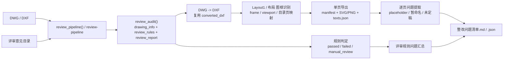

# Review Pipeline

`review-pipeline` 用于把单个 `DWG/DXF` 的评审规则审查流程固化成一次接口调用：

- 输入：一份待复审图纸 `DWG/DXF`，以及对应的 `评审意见` 目录。
- 输出：评审规则审查报告、按图框拆分后的单页图像/文本清单、正式 `整改问题清单`。

## 当前实测基线

本仓库当前实际跑通并保留产物的案例是：

- 图纸：`docs\珠海金湾供电局2026年3月配网业扩配套项目--2项\评审前\030451DY26030001-南水供电所景旺电子（厂房一）10kV业扩配套工程\附件3 施工图\南水供电所景旺电子（厂房一）10kV业扩配套工程.dwg`
- 评审意见目录：`docs\珠海金湾供电局2026年3月配网业扩配套项目--2项\评审意见`
- 输出目录：`tmp\review_pipeline_030451DY26030001_docdriven\20260415T070348Z`

这组输入/输出是当前 README、实现说明和整改清单整理的主要依据。

## 当前补充验证案例：擎能模板（罗定加益项目）

这轮补充验证了 `擎能` 模板下的真实工程：

- 图纸：`docs\罗定供电局2025年中低压配电网第十批紧急项目--4项\罗定供电局2025年中低压配电网第十批紧急项目施工图--评审前\罗定供电局2025年中低压配电网第十批紧急项目施工图\加益供电所10kV合江线新增配变及黄沙公用台变改造工程\附件3 施工图\图纸-加益供电所10kV合江线新增配变及黄沙公用台变改造工程.dwg`
- 评审意见目录：`docs\罗定供电局2025年中低压配电网第十批紧急项目--4项\评审意见及回复\评审技术要点`
- 输出目录：`tmp\review_pipeline_jiayi_cli_case\20260422T062918Z`

关键结果：

- `split_page_count = 94`
- `page_issue_count = 2`
- `review_issue_count = 39`

这个案例主要覆盖：

- `布局` 空间图框识别
- `擎能A3横/竖`、`擎能A4竖` 图框块名
- 标题栏图号/图名提取
- `page_seq` 与标题分册号 `1/3、2/3、3/3` 提取

## 架构流程图



## 模块分工

| 文件 | 责任 |
| --- | --- |
| `sparkflow/__main__.py` | CLI 参数解析与命令暴露 |
| `sparkflow/review.py` | 图纸结构化提取、评审意见文档加载、结构化评审规则生成、规则审查报告生成 |
| `sparkflow/review_workflow.py` | 编排 `review_audit`、图框拆分、单页文本提取、整改清单汇总 |
| `sparkflow/cad/parse.py` | `DWG/DXF` 解析与 `DWG -> DXF` 转换入口 |
| `sparkflow/cad/dwg_converter.py` | 外部转换器执行 |
| `tests/test_review.py` | 评审规则审查与整改单生成回归测试，基于 `tests/fixtures/review_baseline/030451DY26030001/fixture.json` 的正式脱敏项目夹具 |

## CLI

```powershell
python -m sparkflow review-pipeline `
  "D:\path\drawing.dwg" `
  --review-dir "D:\path\评审意见" `
  --out "D:\path\out" `
  --project-code 030451DY26030001 `
  --dwg-backend cli `
  --dwg-converter "D:\Program Files\ODA\ODAFileConverter 27.1.0\ODAFileConverter.exe" `
  --dxf-backend ascii `
  --skip-sparkflow-audit
```

如果是在 Windows / PowerShell 下反复复跑同一工程，建议直接使用仓库内的包装脚本：

```powershell
.\scripts\run_review_pipeline.ps1
```

说明：

- 这个脚本会读取 [scripts/run_review_pipeline.ps1](../scripts/run_review_pipeline.ps1) 顶部的默认变量，适合把常用 `DWG`、`评审目录`、`输出目录`、`ODAFileConverter.exe` 路径固化下来。
- 仍然支持命令行覆盖，例如：`.\scripts\run_review_pipeline.ps1 -Out "tmp\\review_pipeline_cli_override"`。
- 这样可以避免 PowerShell 多行反引号命令在复制粘贴时把下一条 `python ...` 拼进当前参数列表，出现 `--skip-sparkflow-auditpython` 这类错误。

标准输出依次返回：

1. `run_dir`
2. `整改问题清单.md`
3. `整改问题清单.json`
4. `split/manifest.json`
5. `review_report.json`

## Python API

```python
from pathlib import Path

from sparkflow.cad.parse import CadParseOptions
from sparkflow.review_workflow import review_pipeline

output = review_pipeline(
    Path(r"D:\path\drawing.dwg"),
    Path(r"D:\path\评审意见"),
    Path(r"D:\path\out"),
    project_code="030451DY26030001",
    parse_options=CadParseOptions(
        dwg_backend="cli",
        dwg_converter_cmd=[r"D:\Program Files\ODA\ODAFileConverter 27.1.0\ODAFileConverter.exe"],
        dxf_backend="ascii",
    ),
    include_sparkflow_audit=False,
)

print(output.rectification_checklist_md_path)
print(output.split_manifest_json_path)
```

## 产物结构

每次运行会生成一个时间戳目录，核心产物如下：

- `review_report.json` / `review_report.md`
- `drawing_info.json`
- `review_rules.json`
- `整改问题清单.md` / `整改问题清单.json`
- `split/manifest.json`
- `split/pages/*.svg`
- `split/pages/*.png`
- `split/pages/*.texts.json`

### `split/manifest.json` 关键字段

每个单页对象至少包含：

- `seq`：按图框扫描后的原始顺序
- `page_seq`：稳定的逐页顺序编号；当 `primary_code` 在多页重复时，优先用它做页面唯一编号
- `sheet_no`：仅在页内图号尾段本身就是页码时才填充；例如 `...-08`
- `title_part_no` / `title_part_total`：从页标题中的 `1/3、2/3、3/3` 提取出的分册号
- `primary_code`：优先从标题栏提取出的工程图号
- `title`：优先从标题栏提取出的页名
- `codes`：该页识别到的全部候选图号
- `placeholder_texts`：该页占位符或未定稿文本

对于 `擎能` 模板这类“一个工程图号覆盖多页”的图纸，常见情况是：

- `primary_code` 在多页相同
- `sheet_no` 为空
- `page_seq` 表示真实页序
- `title_part_no/title_part_total` 表示同一标题下的分册序号

## 当前实现范围

- 支持先通过 `review_audit()` 生成评审规则审查结果，再自动复用其 `DWG -> DXF` 中间产物做拆分。
- 支持基于 `Layout1` 或 `布局` 图框识别拆分页。
- 支持旧模板 `frame_a3l1hfl/frame_a3l1vl/frame_a4l1v` 与 `擎能A3横/竖`、`擎能A4竖` 图框名。
- 支持提取目录页图号与图名映射，用于补齐单页标题。
- 支持优先从标题栏提取页名与工程图号，并过滤 `图号`、`设计阶段`、`施工图` 等标题栏字段标签。
- 支持提取标题中的 `1/3、2/3、3/3`，并写入 `title_part_no/title_part_total`。
- 支持在重复 `primary_code` 的情况下输出 `page_seq`，用于唯一定位每页。
- 支持识别 `viewport` 页面，并把模型空间文本/线段映射回单页图框。
- 支持根据占位符文本和评审规则结果，自动生成正式整改清单。
- 当 `评审技术要点` 目录下同时存在多个 `.xls/.xlsx` 时，会优先按文件名中的工程名/工程编号筛选候选工作簿，只有未命中文件名时才回退到打开 Excel 读表内容。

## 已知限制

- 复杂块参照、填充、图像等非线性图元目前以“可复审优先”为目标，拆分页更偏向审查证据提取，不等同于 CAD 原生出图质量。
- `manual_review` 类规则仍需结合说明书、预算书、附件等人工闭环，不能只依赖 `DWG`。
- 对于 `擎能` 模板这类项目级图号，`primary_code` 往往是工程图号，不一定是一页一个独立图号；逐页定位请优先看 `page_seq` 和 `title`。
- 老式 `.xls` 读取依赖本机 Excel COM；虽然候选文件已经尽量先按文件名缩小，但在文件名不规范的目录里首次读取仍可能比 `.xlsx` 慢。
