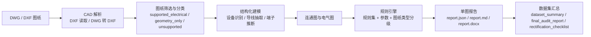
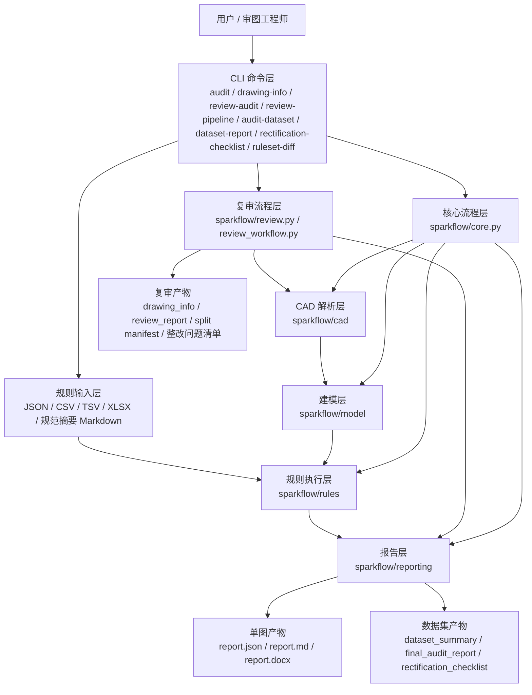
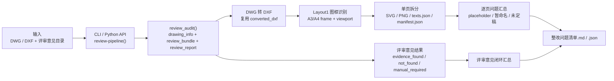
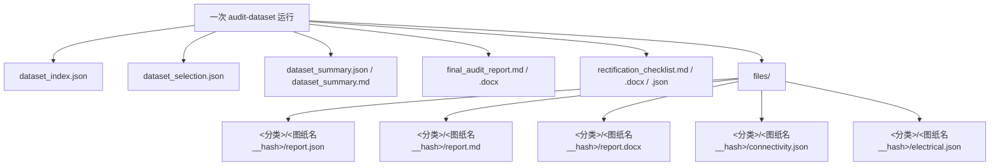

# SparkFlow

SparkFlow 是一个面向配电/一次系统图审查场景的 CAD 自动审图 CLI 工具。它当前聚焦于 `DWG/DXF -> 解析 -> 建模 -> 规则检查 -> JSON/Markdown/DOCX 报告` 这条本地批处理链路，适合研发验证、规则迭代、样本集回归和项目级离线审图。

## 项目定位

- 优先场景：一次系统图、单线图、电气图、配电箱/开关柜/电缆分支箱类图纸
- 当前形态：本地 CLI 工具 + 批处理工作流
- 当前边界：不是在线平台，也不是“任意规范文档自动转规则”的完整产品
- 当前优势：可对目标图纸稳定输出结构化报告、数据集汇总、最终总报告、整改清单

## 核心能力

- `DWG/DXF` 图纸审图
- `drawing-info` 单图结构化信息提取
- `review-audit` 结合评审意见目录生成文档驱动复审报告
- `review-pipeline` 一次完成复审、按图框拆分、整改问题清单生成
- `audit-dataset` 批量审图与筛图
- `dataset-report` 数据集最终总报告
- `rectification-checklist` 失败图纸坐标级整改清单
- `ruleset-diff` 规则集版本差异比对
- 规则集支持：
  - 结构化 `ruleset.json`
  - `CSV/TSV`
  - `XLSX`
  - 结构化规范摘要 `Markdown`
- 报告输出支持：
  - `report.json`
  - `report.md`
  - `report.docx`
  - 数据集总报告 `final_audit_report.md/.docx`
  - 整改清单 `rectification_checklist.md/.docx/.json`

## 总体流程图



### 当前阶段说明

- 本阶段仍是工具型产品（单场景闭环），不是在线平台服务
- 典型闭环流程：上传图纸、解析建模、规则检测、输出报告、人工整改、复审确认
- 当前默认最高能力层级是“拓扑 + 规则”，核心产物包括 `connectivity.json` 与 `electrical.json`

### 审图能力分级

- Level 1：图元抽取，输出实体类型/图层统计、bbox、关键坐标
- Level 2：设备对象识别，从 `INSERT +` 附近文本构建设备与端子
- Level 3：拓扑关系建模，对候选导线进行拆段、吸附聚类、连通分量分析，并运行拓扑级规则

### 语义边界

- 拓扑是“候选导线”的几何连通拓扑，需要通过图层/线型/长度过滤减少 DIM、标注引线等噪声
- 设备类型识别与端子模板依赖规则库持续补齐；未命中模板时会退回到附近线端点聚类/默认端子策略

## 功能架构图



## 文档驱动复审实现方案

当前项目里已经把“输入一份 `DWG` + 一份评审意见目录，输出复审结果和整改清单”的链路收口成稳定接口：

| 层级 | 文件 | 责任 |
| --- | --- | --- |
| CLI 入口 | `sparkflow/__main__.py` | 暴露 `drawing-info`、`review-audit`、`review-pipeline` 三个命令 |
| 图纸抽取 | `sparkflow/review.py` | 提取 `drawing_info.json`，加载 `评审意见` 目录，生成 `review_report` |
| 复审编排 | `sparkflow/review_workflow.py` | 复用 `review_audit()` 结果，执行图框拆分、单页文本提取、整改清单汇总 |
| CAD 基础能力 | `sparkflow/cad/*` | `DWG -> DXF` 转换、`DXF` 解析、视口/图元基础读取 |
| 结果输出 | `docs/review-pipeline.md` | 说明命令、Python API、产物结构和已知限制 |

### `review-pipeline` 架构流程图



### 典型输出

- `drawing_info.json`：图纸结构化摘要、唯一文本、占位符文本
- `review_bundle.json`：从 `评审意见` 目录抽取出的项目/意见/回复数据
- `review_report.json/.md`：文档驱动复审结论
- `split/manifest.json`：图框拆分页清单
- `split/pages/*.png|*.svg|*.texts.json`：单页图像和文本证据
- `整改问题清单.md/.json`：正式整改问题清单

## 输出示意图



## 当前命令

```text
sparkflow audit
sparkflow index
sparkflow drawing-info
sparkflow review-audit
sparkflow review-pipeline
sparkflow audit-dataset
sparkflow dataset-report
sparkflow rectification-checklist
sparkflow ruleset-diff
```

## 快速开始

### 1. 安装环境

要求：

- Python `3.10+`
- Windows PowerShell 或命令行
- 依赖包：
  - `ezdxf>=1.4.3`
  - `python-docx>=1.1.0`
- 可选：
  - `ODA File Converter`，用于 `DWG -> DXF`
  - `AutoCAD + pywin32`，用于 `autocad` 后端

安装：

```powershell
python -m pip install -U pip
python -m pip install -e .
```

推荐在 Windows 上开启 UTF-8：

```powershell
$env:PYTHONUTF8='1'
```

或直接：

```powershell
python -X utf8 -m sparkflow --help
```

### 2. 单图审图

```powershell
python -X utf8 -m sparkflow audit "image\\111\\配电部分CAD\\低压开关柜DK-1\\380V.dwg" `
  --out out `
  --ruleset rulesets\\example `
  --dwg-backend cli `
  --dwg-converter "D:\\Program Files\\ODA\\ODAFileConverter 27.1.0\\ODAFileConverter.exe"
```

### 3. 数据集批量审图

```powershell
python -X utf8 -m sparkflow audit-dataset "image\\111\\配电部分CAD" `
  --out out_oda_dataset `
  --ruleset rulesets\\example `
  --dwg-backend cli `
  --dwg-converter "D:\\Program Files\\ODA\\ODAFileConverter 27.1.0\\ODAFileConverter.exe" `
  --workers 3 `
  --dwg-timeout 300
```

### 4. 生成数据集总报告

```powershell
python -X utf8 -m sparkflow dataset-report out_oda_dataset\\20260325T100443Z `
  --ruleset rulesets\\example
```

### 5. 生成整改清单

```powershell
python -X utf8 -m sparkflow rectification-checklist out_oda_dataset\\20260325T100443Z
```

### 6. 比较规则集差异

```powershell
python -X utf8 -m sparkflow ruleset-diff rulesets\\example rulesets\\stategrid_peidian_strict `
  --out out\\ruleset_diff
```

### 7. 文档驱动复审与整改清单

```powershell
python -X utf8 -m sparkflow review-pipeline "docs\\项目图纸\\example.dwg" `
  --review-dir "docs\\项目评审意见" `
  --out out_review `
  --project-code 030451DY26030001 `
  --dwg-backend cli `
  --dwg-converter "D:\\Program Files\\ODA\\ODAFileConverter 27.1.0\\ODAFileConverter.exe" `
  --dxf-backend ascii `
  --skip-sparkflow-audit
```

返回结果依次为：

1. `run_dir`
2. `整改问题清单.md`
3. `整改问题清单.json`
4. `split/manifest.json`
5. `review_report.json`

## 典型输出目录

`audit-dataset` 运行目录通常包含：

```text
<run_dir>/
  dataset_index.json
  dataset_selection.json
  dataset_summary.json
  dataset_summary.md
  final_audit_report.md
  final_audit_report.docx
  rectification_checklist.md
  rectification_checklist.docx
  rectification_checklist.json
  files/
    <分类>/<图纸名__hash>/
      report.json
      report.md
      report.docx
      connectivity.json
      electrical.json
```

## 文档导航

- [项目概览与架构](docs/architecture.md)
- [快速开始与命令示例](docs/quick-start.md)
- [规则集与规则输入](docs/rulesets.md)
- [报告与整改清单说明](docs/reports.md)
- [文档驱动复审与整改清单流程](docs/review-pipeline.md)
- [部署、环境与运维建议](docs/deployment.md)

## 仓库结构

```text
sparkflow/        核心源码
rulesets/         示例规则集、严格规则集、表格/XLSX/规范摘要示例
catalog/          设备模板、导线过滤配置
scripts/          辅助脚本
tests/            测试
image/            样例图纸
docs/             使用与部署文档
```

## 现在适合用它做什么

- 对既有样本集做批量审图
- 对规则集做回归验证和差异比对
- 生成项目级最终总报告和整改清单
- 迭代设备识别、规则和报告格式

## 现在还不适合直接承诺什么

- 任意规范文档自动转可执行规则
- 任意图纸类型稳定审图
- 在线多用户平台能力
- 完整的人工复核闭环系统

## 相关规则集

- [example](rulesets/example/ruleset.json)：默认示例规则集
- [stategrid_peidian_strict](rulesets/stategrid_peidian_strict/ruleset.json)：严格规则集目录名；当前 `ruleset.json` 内部 `version` 为 `stategrid_peidian_strict_v1`，用于将 `wire.floating_endpoints` 提升为严格判定
- [example_table](rulesets/example_table/ruleset.json)：表格规则集示例
- [example_xlsx](rulesets/example_xlsx/ruleset.json)：Excel 规则集示例
- [example_normative](rulesets/example_normative/ruleset.json)：规范摘要规则集示例

## 开发提示

- 当前工作树可能包含大量实验产物和历史输出，提交或归档前建议先确认目标运行目录
- 处理中文路径和中文 Markdown/DOCX 时，建议始终使用 UTF-8
- 若在 PowerShell 中拼接内联脚本生成中文文本，容易出现 `?` 替换，建议优先使用仓库内正式命令和模块
